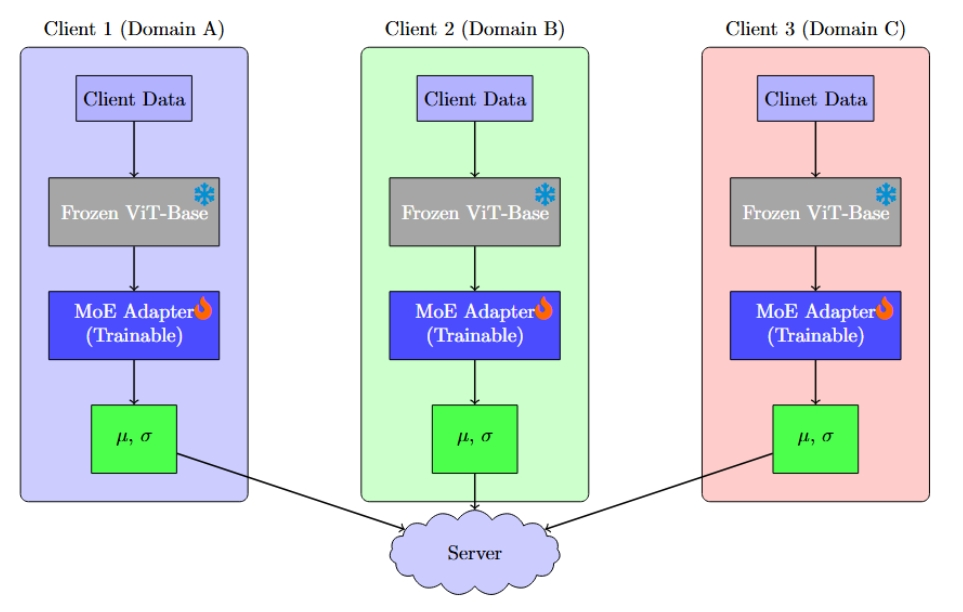
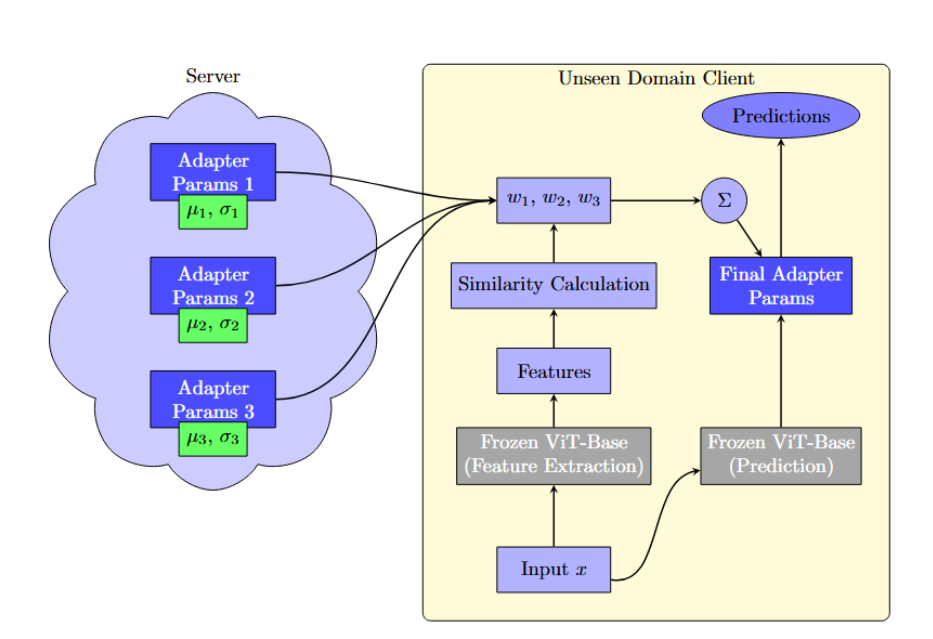

# FedDG-MoE: Test-Time Mixture-of-Experts Fusion for Federated Domain Generalization

## Requirements

- Python 3.9.7
- numpy 1.20.3
- torch 1.11.0
- torchvision 0.12.0

Figure 1: Federated Domain Generalization Architecture. Each client (Domains A, B, C) processes local data through a frozen ViT-Base model followed by  a trainable MoE Adapter. The resulting parameters (µ, σ) are sent to the  federated server for aggregation.

Figure 2: Federated Domain Generalization Inference Architecture. The server stores adapter parameters (μ, σ) from multiple domains. For an unseen domain, the client extracts features, calculates similarity to known domains, and creates weighted adapter parameters for final prediction while maintaining frozen ViT-Base backbones.

## Dataset

Firstly create directory for log files and change the dataset path (`pacs_path`, `officehome_path` and `vlcs_path`) and log path (`log_count_path`) in configs/default.py.

Please download the datasets from the official links:

- [PACS](http://www.eecs.qmul.ac.uk/~dl307/project_iccv2017)
- [OfficeHome](https://hemanthdv.github.io/officehome-dataset)
- [VLCS](https://drive.google.com/uc?id=1skwblH1_okBwxWxmRsp9_qi15hyPpxg8)

## Training / Testing

To train using our best variant for office home and test on domain p, you can run the command:
`
python algorithms/feddg_moe/train_officehome.py --test_domain p --avg_tokens --num_layers 2 --test_batch_size 32 --domain_tracker offline_cosine_muvar --normalize_features --inv_temp 2 --note offlinecosinemuvar_nofeatnorm_invtemp2_4layer_avgtokens_fedupd_tbs32
`
Where we aggregate features from the last two transformer blocks, use a `--test_batch_size 32`, we track the mean and std stats of client features `--domain_tracker offline_cosine_muvar`, and we do normalize those features using the std `--normalize_features`. Mixing probabilities of client MoEs are calculated with a softmax of inverse temperature `--inv_temp 2` of 2 

## Acknowledgement

Part of our code is borrowed from the following repositories.
- FedDG-GA [https://github.com/MediaBrain-SJTU/FedDG-GA]
- FACT [https://github.com/MediaBrain-SJTU/FACT]
- DomainBed [https://github.com/facebookresearch/DomainBed]
- MoA [https://github.com/cvlab-kaist/MoA]
- SCAFFOLD-PyTorch [https://github.com/KarhouTam/SCAFFOLD-PyTorch]

We thank to the authors for releasing their codes. Please also consider citing their works.
